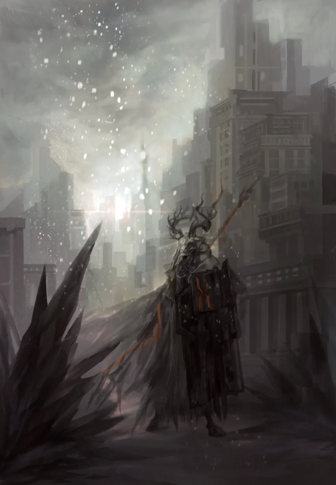

我相信会有一个世界，人可以想爱上谁就爱上谁……为此，至死方休。 {.textkai}

<!-- more -->

我的猫死在一个冬雨淅沥的清晨。我把它埋在山丘上，竖了一个木十字架。它左边埋着的痨病鬼在踢了它一脚后死去，死前哀叹着“看见黑猫真是不幸”，而同样被碾碎的那条生命他早已忘记。

在它苟延残喘的日子里我被胆怯的轻雾笼罩，屡屡想去复仇却又不敢离它分毫。我肯定这惧怕并不来源于死亡，因在自小收留我的诊所里，永远有人在与那双漆黑的脚捉着迷藏。有时我看见它走进病房，旋即听到许多人哭喊，他们流泪的双眼像两扇晶莹的大门渴望着死者的灵魂，而那缕轻雾却永远会跟上那黑色的双脚。这没关系的，我曾笑着对一个失掉孩子的女人说，他只是去山丘上玩下一场捉迷藏。我以为我能安慰她，可我收获的只是她丈夫的一记耳光，连着“多嘴的魔族佬”之类的称号。

后来我捡到了那只黑猫，并常常看见他徘徊在将死之人的屋旁。人们说它的尿是死神的记号，痨病鬼踢死它时他们都松了口气，而我为它洗过六个月的砂盆，坚信那黑色的脚印不会被孩子的双手抹掉。我背着他们扎人的眼光抱起黑猫，诊所的医生却说这里没有给它的药。我想他在说谎，可痨病鬼的咳嗽声却让我躲到一旁。他央求一针药剂，而医生瞟一眼我和我的黑猫，说：

“我救不了你，就像我救不了那只猫。”

那一刻我的肺叶是两片鲜嫩的薄荷。痨病鬼要查药柜，而医生任他检查，并说药剂在两天前已被一伙伤兵掳走。痨病鬼骂骂咧咧地出了门，而我以崇拜的眼神望向医生，而他说：

“别那样看我。这里一点药也没了。”

我愣住了，随后一把铲子塞进我手心，他蹲下身来抚摸我的头：

“我放弃了一个病人，孩子。”

“是在为猫咪出气吧？别骗我，快救救它。”

“不，我什么药也没有，我只能放弃。孩子，这不是出气也不是复仇，无论有什么借口，人都该明白自己在做什么。”

他垂首看着奄奄一息的猫，随后起身让我好好陪它最后一程。我就这样来到这个铅色的清晨，看见我的猫儿踱着黑色的步伐向着雾中走去。医生说我该明白自己在做什么，那么我便说，在十四岁这年，我亲手埋葬了我唯一的好朋友。再明白一些，这座村庄里唯一会对我好的只有医生了。意识到这一切后我大声地哭，镇上人常说，魔族佬的哭声不吉利，可我觉得那帮人的眼里只有猫尿，便哭得愈发肆无忌惮。

泪眼里我望见一双黑色的脚，它厚重、阔大，如一对钢杵。那个游荡于诊所中的幽魂走出阴影，我呆呆仰头，大角的阴影就落到了脸上。过去它撞穿无数人的身躯，未来又将撕碎这片深青的密林，但此刻它只是温柔地俯下，向我探问前方村庄的名字。我回答，不假思索，十五年后的军事法庭上，当法官问起我的背叛从何时开始，我的记忆便滑进这片山坡，词句脱口而出，柔顺如那天滑下花瓣的冬雨：

“从我的猫死去的那天。”

---

在那个有着大角的人来之前，我不知道有个国家叫乌萨斯；在他来之后，我也忘了有个地方叫卡西米尔。他的队伍像一队乌鸦经过村庄，只从吓坏的屠户那儿叼走些许牛羊，再于没有药品的诊所里带走了医生。如果我的猫儿还在，或许我会继续守在它的水盆边，看它的小红舌尖梳着水面。然而它走进薄雾，薄雾里那支队伍走出，披着黑色甲胄的男人们浸着死亡的忧郁，这气质比那领头人的大角更使我感到他们与我是同族。我跟上队伍，像从前我的猫跟着我，他们要做什么，我并不知道，可与我亲近过的人们都在这里，我想它便是我的故乡。

日暮时分队伍扎了营，医生拉着我到橡树从边，质问我知不知道自己在做什么。我回答说，知道，我找了一处舒服的地方，像那天的猫儿睡在小花坛。他压低声音，说我在找死。我不知他为何那般慌乱。我说，留在那个村庄，我也迟早要因为撒尿而被踢死。

我的逆反使这个向来温柔的男人生了气，他要训斥我，然而阵风吹乱他的气息，摇乱的树影里一个战士铁似地立着。他要医生到大帐。那儿有一点黄豆似的油灯，四张行军床的边缘淌着黑糊糊的东西，像磨到一半的墨块那样难闻。大角男人立在阴影里，他注视着医生检查过四人的伤势，红眼里闪着忧郁的微光。

“有救么？”

“你们的药品只够救一位。”

“那救他。”

医生接过手术包的那刻，大角男人拿来油灯为他照亮，后来的一个小时里他就这样一动不动，营帐里只有柳叶刀切开皮肉的声音。其余三位伤员的沉寂使我惊惧，他们不躲不藏，不妄图以哀嚎将命运吓跑。他们望着大角男人，似乎坚信他做出了正确的选择，哪怕嘴角烧断的筋肉已撑不起一句遗言。那夜我就着松油篝火的噼啪声入睡，浓重的夜露浸满身上的梅花鹿皮。它在梦中咬住我的每寸肌骨，白雾弥漫的林间我轻轻踱步，时时舐过的树皮上的苔藓。忽然间枝叶碎地，一声狮吼，露珠纷落如雨。我吓得四蹄飞奔，于山崖下回望，见一只雄狮昂首，黧黑的脊梁似与夜铸在一起。它瞟我一眼，转而向远方的树林低吼。大地顿成一张兽皮鼓面，迭起的林涛中我畏惧地垂首，余光瞥见它那阔大的黑色脚掌，并隐约领悟它便是这片土地上行走的死亡。

这时玻璃的破碎声刺破我的梦境，我起身，一支弩箭就擦着头皮飞过。我一下子明白医生口中“找死”的意义，翻身一滚，在草丛中埋起头来。呐喊与兵击声交叠一处，我蜷缩着，直到一枚燃烧弹飞到身后。被热浪扔出草丛的一刻，我瞥见大角男人抡起长矛，几个人就像气球般飞上树梢。那漆黑的脚步震动着大地，粉红色的气球破片碎落一地，我没有战士们的勇敢，于是哀嚎，恸哭，当黎明迈着艰涩的脚步走过树林，我的喉舌已和晨风一般枯焦。

战士们挖完坑，烧完人，平完土，我才从呆滞中醒来，并想到该去找医生。那时他正与大角男人谈着话，脚边开着一朵血色的花，花下是一只新褪的乳胶手套：

“卡西米尔人死了多少？”

“一坑。”

“一坑是多少？”

“两枚二级勋章。”

“我是问你杀了我们多少人。”

“‘你们’是谁？”

大角男人用枪尖指向一处土丘：

“你说他们和你一起，那卡西米尔人就都应与我们为敌，可我不记得你镇上的人们阻拦过我们。”

“我们的老医生，一个日日咳得要死还坚持每天十根烟的老头，就死在他们的松油燃烧弹下，而那时他正为你们的妇女接生。我们找到他时他已成焦炭，最好的刀也分不开他与他怀中的孩子。这就是你们的军队，一群贵族与领主的恶犬。”

医生沉默许久，说：

“那你们还是侵略者。”

“那是你以为。”

大角男人注意到双唇干裂的我，就要摸酒瓶，又转而用枪尖挑起行军壶送过来。那枪尖攀着血锈，我颤巍巍拧开瓶盖，里面盛着的却是一汪清水。就要喝时医生牵住我的手快步离开，并听到身后大角男人的冷笑：

“谴责我们吧，去吧，你自己坚信的总高于其他。”

医生带我来到溪边，凝望着残红的水流，他忽然转向我，语调悲凉：

“孩子，他们说的话，一个字也别信。我们的国家是不好，可这些人？我从没见过，一副棋盘上的黑子能解放白子。”

“可你救过他们的命。”

“因为我是医生。”

“可他们是‘侵略者’。”

“‘侵略者’也是人呀。”

他的语气缓和了一些，而我歪歪头，问道：

“那你救的是人还是‘侵略者’呢？”

他的身体颤动一下，忽然回身打飞了我手中的水瓶。那一下声响很闷，他捂着手，双眼像蒙了层薄雾，整个神情说不出的苦。我还有好多问题，可他喃喃着说，别问了，别问了，踉跄着跌坐在溪上。我拭掉脸上暗红色的水珠，发现那个被打飞的水瓶正顺着水流漂回来。我想去捡，又被他颓唐的眼光束了手。放弃痨病鬼的那个清晨，他也未露出那样的目光，可这时他便这样看着我，在溪边，静静的，水壶漂过他身边，漂过一处石缝，漂成血河里一滴清亮的句点。

---

晌午天气大好。队伍翻过山头，便看到一条银带般的河流于溪谷间闪着光。战士们的神情都显出欢喜，而在大角男人宣布就地休整前，没有一个人欢呼着滚下冬雨后湿软的泥土。医生，大角男人和我在林间坐下，河岸边，人们忙活，快活，活似一群春日的莺鸟，而大角男人深呼一口气，感慨卡西米尔的冬天总是如此温顺。医生低下头去，而我朦胧地意识到，他那双黑色的双脚已不止一次踏上这片土地。我问他，这队伍要去哪，而他只说：

“胜利。”

不远处飙起一道血花。一头肉兽的喉咙插着投枪，它追逐着战士，茫然而愤怒。它的角最终撞在树上，战士们哈哈大笑，并嬉闹着将那投枪来回穿插直到头垂下。目睹了这一切的医生面上几无血色，整个中午他没吃过一口饭，而我却以为这是我吃过最香的兽肉炖土豆。这次他并未打翻我的碗，只是摸着我的头，目光无限悲戚。他几乎是小心翼翼地问我：

“我们算不算叛国？”

“吃饭就是叛国嘛？”

“吃谁的饭，这很重要。”

“从前我吃你的饭。你是卡西米尔人，那我也是卡西米尔人嘛？”

医生愣住，随即肯定。我不解，又问：

“那粮食都是地里长的。我和他们都是地养大的，那我们为什么要分什么什么人呢？”

这次医生完全沉默，而我继续狼吞虎咽，让肉汤土豆填满我对这支队伍的忠诚。我不在意国界，不在意敌我，我相信我的肚皮能包容下烫人的仇恨，除它之外，我唯一在意的或许就是医生，从前还有黑猫。然而它黑足轻柔的潜行已被一段段坚实的行军取代，在战斗与休眠的缝隙间我亦插不进留给猫儿的念想，就连梦中，我也只看见那只铁铸的雄狮，并在清醒后一点点确信那便是长角男人的化身，唯一的不同是它长满死亡的黑鬃。

{style="float:right;max-width:45%;margin-left:1em"}

我就这样与这支漆黑的狮群相伴，在长角男人——或者该说是博卓卡斯替长官——的指挥下帮助清扫着战场。我不会用刀，更不会杀人，所幸我还能吃苦，便从尸堆与粪坑中捧出了让指挥官留我在这儿的理由。然而这理由也不过我的一厢情愿，让队伍真正接纳我的该是医生。他温文儒雅的气质深深吸引着这些文化贫瘠的战士，仅三个星期后博卓卡斯替就愿将老医生的口琴托予他，从此深夜的篝火随音符跳动，战士的乡思长久地回旋于风中。后来的日子里他亦不再提什么立场，柳叶刀、药水与伤员就是他的行囊。我对这转变感到惊奇，而博卓卡斯替不以为然。“要么适应，要么神经。”他如此说着，而我隐约感到他已发白发硬的鬓发也曾是两丛春寒中惶恐的青草，但我对身外逝去的春天兴致索然，只愿战士们的长刀能更久一些睡在刀鞘。

向北行进的第三十二天，我们于密林间撞见了一队逃兵。他们丢盔弃甲，神色灰暗。博卓卡斯替大致了解了情况，便宣布将他们处死。埋尸体时我瞥到医生厌恶的神采，我轻声问他怎么了，而他摇晃着酒瓶，长叹短吁：

“温迪戈吃自己人是真的…….”

我想博卓卡斯替早已习惯这样的议论，就如我习惯了“魔族佬会带来厄运”。那时他正向战士们宣讲着即将遇到的敌人。战士们将临大敌，面上却涌动着火热的血色。讲演的最后博卓卡斯替挥起右臂，一片洪亮的应和声中我们再度启程，并于一处溪谷的那头望见一队银色的骑士。

战斗以温迪戈吹响一支火蚁蚀穿的树桩开始，又以这支树桩砸碎骑士的脊梁结束。没能目睹那甲胄的碎烂在后来的很长一段时间使我遗憾，在儿时，这些闪光的甲胄曾如铁墙压近我的身后，而我能做的唯有苦苦哀求。而如今那个被狩猎的魔族竟能与一个小骑士搏斗，并用他的剑锋划开了他的喉咙。我惊讶于他面甲下稚嫩的面容，并被他眼中黯淡下的湖蓝所淹没。马蹄借机蹬到我的胸口。那一刻我听到我喉咙里血的翻涌，出口时却是猫的叫声。我只来得及像那只黑猫般蜷起身，便掉入一片黏腻的泥沼。卡西米尔的第一场春雨后，湿草地里常常有那样的沼泽。逃离追猎的路上我曾一度陷进，而此时青草与烂泥的苦腥再度萦满肺腔，是一记雷声劈开我身中的滞胀。起身时，我见乌云涌过河湾，见铁狮子独立于泥河畔。它缓缓回头，那是我第一次与它对望，双腿因惊惧而不住颤抖。它唤我走向那墨色透染的荒原，可迈步的一刻无数林木拔地而起，我猛地咳嗽起来，喷出的却只不过淤血。

地上是厚厚的松针，月光于林间空地上浮动，枝叶的影子软得朦胧。身后忽然传来一个温暖的拥抱，连着医生熟悉的气息。他将我抱进营地，检查完身体后又一勺一勺汤的将我喂饱。我受宠若惊，而更使我惊讶的是战士们的眼光：他们似乎本不相信我能活着回来，可看到我的角后，都露出些释然的笑意，仿佛一切都不过是场梦。

医生歉疚地向我解释了一切，说到最后他几乎含了怒意，而我只是捧着碗发笑。

“他理应放弃我。在战士与孩子间，他知道取舍。”

“到营帐中做手术时我就明白了，孩子。但最终救人的是我，不是他，即使是医生，也没有放弃亲人的义务。”

“那你放弃我了吗？”

他沉默。

“算了吧。活过来了，就别想那么多。”

我轻拍了拍他的肩膀，并惊异地发现在他面前我已宛若一个大人。他仰望着我，双眼像极了那头迷茫而痛苦的肉兽。这一刻我悲哀地意识到，原来决定人是否成熟的不是生命的长短，而是他能否让生活与苦痛融洽相处。我该劝慰他，劝他别将世事都用柳叶刀细细解剖，劝他相信这世道不是棋而是锅乱炖的汤。可那时我才十四岁，很多话还由不得我讲，即使它们都是生活的训诂，与医生将要领悟到的同样。

这一天后的医生像掉了魂。他仍如往常般谈笑风生，而那蒙着雾的双眸却使我想到埋葬黑猫的那个清晨。“惧怕自己，惧怕一切”，博卓卡斯替对他的异常如此评价，并不无遗憾地向我表示自己只是个战士。我问他能不能让医生回家去，开口那刻我便意识到这话的可笑，无论如何，这支队伍都是所谓“侵略者”。而博卓卡斯替听着忧郁的口琴声，用枪尖于林地上划开一条线：

“会师之后，他就可以把琴还给我们了。”

这个消息使我振奋，我急着要去告诉医生，而博卓卡斯替却按住我：

“这不是个承诺。在终点前，谁也不能承诺。”

我怔怔地点头。两天后我们进入一处男爵的领土，老男爵在逃跑前被抓住，被押到博卓卡斯替面前时已惊惧得失禁。他向他打听这里最好的医生，得到的答复是连护士都被抽调进了军营。战士们本想把他扔给镇民们处置，然而恐惧却先一步压碎了他脆弱的心脏。丢了乐子的人们深深怅惘，正要启程却收到电报：就地驻扎。

就这样我们于庄园住下，撬开地下室的门后，医生一度于金银财宝之间迷失了方向，而这幸福的沉醉却很快被博卓卡斯替打破：

“这都是赃物，医生。”

而医生无意论辩，只问他要怎么做。博卓卡斯替说：

“钱是金色的刀枪。”

医生早有预料地点头。

“而我们用它刺入你们的心脏。”

随后他招来战士，一小时后城镇的居民于金山前呆楞住，似乎从未想过自己的血汗会流回身旁。惊讶之后的狂喜使我们交融为一，之后数日我们源源不断得到粮米酒肉，高亢的民歌里人们与新生的嫩叶一同舞蹈，这片大地将要入春，蹒跚在雪中的唯有医生。

有天我结束守夜，于黎明钻进梦乡。我看到一只驼兽卡在灌木中，彷徨的泪眼盯得我心发颤。梦醒时，夕阳仿佛一跃而至，松油火舌舔舐着星星。温暖的炖煮声里，我觉得每张战士的脸都那么亲切，即使我从未和他们搭过什么话。这时我看见医生远远地立在门边，他脱下白大褂，罩着一件深青色的旧袍。我唤他来，他便来了，嘴唇却发着青。我想试试汤好了没有，他却按下我的手，折了袍角，垫着碗，一勺一勺喝完了一碗。随后一声悠远的号角宣告晚饭的开始，人们不紧不慢地舀了汤，而医生虚弱的吼声就此响起：

“别喝！……”

博卓卡斯替于风中捕获了这声沉痛的低吟，他踢翻汤锅，并从地上拾起了一朵炖得软烂的毒花。战士们怔愣着看着医生，而我似乎早已料到这一时刻的到来，慢慢地背过了脸去。

“是你干的？”

“是。”

“你清楚你在干什么吗？”

“我从来都很清楚。”

“那为什么停手？”

“因为我清醒了。”

他顿了顿，说：

“我清醒到除了清醒一无所有。”

医生似乎吐了血。博卓卡斯替似乎叹了气。我听到一个人唤我的名，声音那么喑哑。我双腿颤抖地来到他身前，有人塞给我一柄刀，我猜那是博卓卡斯替。我想回身问他要怎么做，因为我他妈不知道，不知道！

……可医生，我在这世上唯一的亲人，托起我的手腕，托住那刀柄，那样温柔，那样坚定：

“别想。”

“做你觉得正确的。”

“就像我一样。”

那天夜里下起小雨，我睡在庄园的壁炉边，梦中的一滴驼兽眼泪滑进手心，而天明时陪伴我的只是冷硬的刀柄。我走上台阶，走过长廊，走向象牙阳台边凝望着小雨的博卓卡斯替。那天的林中有狮子在吼，他开口，称我为列兵。

我接到的第一个任务很简单：去做些路障堵路，再帮着战士们搭起瞭望塔。过去我常常于山野中玩耍，然而做起路障的感觉却不同于搭些自娱自乐的玩具。我是列兵，我对自己说，他们把我当同伴，在这儿养猫也不会有人忌惮。这气氛使我舒适，并情愿按博卓卡斯替的命令行事。竖起第一座瞭望台时我不自觉地微笑，树林间荡着秋千的伙伴问我笑什么，我喃喃地说：

“我有家了。”

但还没在瞭望台上守过几晚，电报那头就下达了转移的命令：前线溃退，紧急支援。拆掉那木台时我怅然若失，而一个叫米什卡的士兵递来了他的酒壶。“来了去，去了来，没什么大不了的，我们人也是这样”，他爽朗的笑声与我们的征途那样漫长，所不同的是他大笑便是大笑，不会像路途那般七拐八绕。昨日命令向东南，明天发报说西北，这边说要驰援，那边说留存阵地。一个星期后电报机再度响起，面对翻译员“返回原处”的指令，博卓卡斯替沉默，说：

“回复他：放屁。”

林间的众人纷纷大笑。我在休整时向他表达了对抗命的忧虑，而他说：

“如果抗命能救命，那么就别犹豫。”

“可抗命不就是叛徒吗？”

他冷笑：“谁是叛徒，谁最清楚。我们只需要知道自己是谁。”

后来我们绕过十五个关卡，躲过四次巡逻队的围剿，行走在卡西米尔的林间，温迪戈手持投枪仿佛一个漫步的老人握着登山杖。然而平安地逃亡终究是逃亡，我将自己看作列兵，就自然开始思考为什么巡逻队总能咬上来。面对这个问题米什卡只是爽朗地笑，说是因为指挥官的名气响，而他引以为豪壮的名气最终在下一次围剿将他埋葬，并将队伍逼进了一座村庄。

那半个小时的躲藏，大抵是我人生最漫长的时光。我缩进一处农家地窖，骑士进门时惊起的老鼠跳上肩膀。这害虫似乎嗅到那未涤去的黑猫气味，我眼睁睁看它打翻了一串瓶罐，那咯噔作响的甲靴将一地梅果踏烂时，我跃上地窖，一把揪住那慈祥的妇人。

“别动！”

骑士真的立在了原地。他甩了个剑花，摊开手说：

“请动手吧先生。你们杀的人越多，我们功劳越大。”

我呆愣住，夹在她脖子上的短刀几乎脱手。随即他给出另一个提议，让我用同伴的藏身处换取逃脱的机会。这一刻我听见屋外狮子的足音，同时感到怀中女人深切的绝望。我露出哭丧似的神情，说：

“她会死的。”

骑士的剑不耐烦地钻出鞘，我的悲悯终于扭曲成冷笑。剑锋刺来，我的手向前一推，身子后倒，一支投枪便振着黑羽飞入。睁眼时墙上开出妖异的红花，我凝望着，伸手，那女人便微笑着折来一朵，还有花瓣于狮子的低吼中纷纷飘落：

“集合。”

夜里博卓卡斯替让我埋葬米什卡，而我只是靠着树桩，听肩上的花儿静静生长。他俯视我，说：

“你在抗命。”

“不，我在想。”

他把铲子插到了地上。

“我推开那个女人的时候，我在想什么。”

“活在这个地方，怎样都会死，可我？我本可以救她……”

他的大手抚上我的头，说：

“士兵不该是怎么想，怎么做；他们怎么做，怎么想。”

“所以我还不是士兵……”

“不。你从一个封号骑士手中活下来，理应得到晋升。”

他向我讲起他带过的十六个少爷兵。王侯公爵的子嗣，孱弱，放浪，柔弱的翅膀只配在歌舞场翱翔。他吊死一个，又任七个挥洒热血，五个陷入疯狂。他勋带的银星减去两颗，而血勇的战士多出三个。

“战场永远让人神志不清。能扛过去，你是战士。不能，就是那医生。”

我问他怎么扛。他把铲子扔过来：

“肩扛。”

而当我望着他的背影陷入惆怅，他忽然回身扔来一小瓶酒。

“到河里洗洗去。虱子都要把你吃掉了。”

那快捂热了的瓶子起初使我愣住，接着便忍不住笑了出来。我迎着风走下山坡，西天的云散开，似乳似泪的月光筛了下来，旋即溶进几颗砂糖般的星星。我解开衣衫，在石头上铺了，倒些酒，又用玻璃瓶来回地轧。那响声吱嘎吱嘎，我心里一阵说不出的酥麻。灌下第一口酒后我想起医生，想起他在透明的夏夜搓洗我疯玩后的衣衫，又用棒槌决定那些虱子的生死，恰如他决定我的吃穿与已成幻梦的未来。第二第三口里我听见他驯顺的呼吸，并决意越过醉雾去追寻那张苍白的忧郁脸孔。就这样我瘫软在幽蓝的水中，看到他身披月光款款走来，被乳胶手套勒出青痕的双手像女人那般洁白。我喃喃地呼唤，妈妈，妈妈，我要怎么办，而他怀抱着黑猫微微笑，神情如那被推出去的女人一般：

“像你父亲那样。”

---

十五年后的军事法庭上，检察官质问我，为何叛国会是因为一只黑猫。而我说，我有两个祖国，第一个已被搅得稀巴烂，而第二个将下达我的审判。我背叛了一个祖国，而下一个祖国背叛了我。法官手指一沓相片，问我是否承认叛国，而我望着法庭的五色玻璃，声音与阳光一般沉静：

“博卓卡斯替承认了吗？”

“我们认为他承认了。”

“那请吧。”

我走下被告席，就如在十四岁的一个午夜我大步迈下月光照耀的山坡。在铁架床上等待行刑队的时间里我回味我的人生，并骄傲又悲凉地发现，从那条午夜的长河起身后，我便踏上了与那叛国者相同的道路。我花了一个月融入队伍，又用了两年成为一名合格的士兵。那时我的仇恨已如游丝，军人证上忧郁的脸孔使我想起那于午夜沸腾的良心。“这便是乌萨斯的军人了”温迪戈为我佩上肩章时长长地叹息，而我及时挂出骄傲的笑意问他何时参的军。	他愣了一下，嘴角第一次向我上挑：

“你说的是哪支军？”

那夜列兵们于流淌满街的庆功酒水中醉倒，有人在礼炮的轰鸣里四散奔逃，又在街角被轻柔地邀进莺燕的怀抱。“你很忧伤，我的英雄。”烛火摇曳的厢房里我蜷缩进女人温暖的怀中，并在黎明随一声号叫挣开温柔的大网，看到她一身浅色的节日裙坐在床边，纤瘦的手指揪着床单：

“我们还会再见面吗？”

“你对多少男人说过这话了？”

“这是第一次，我发誓。”

我转身要走，而她拉住我的袖口，陡然而来的重量沉似每个无爱的黄昏。那一刻我听见内心的连天炮火，慌忙逃出门，又在天竺葵的花影后望见她泪眼迷蒙的面容。她大声喊出她的问题，而我的答复只敢躲在信封：

“海伦，我恳求你，不要指望一个士兵相信誓言。”

当时的信件都由博卓卡斯替亲审。他看过我的信，很小心地将信纸叠起，我从这细小的动作里嗅到爱情的苦杏仁味，紧接着便收到他平静的提醒：

“相思病只有两种疗法：相聚，相离。要用哪一种，你清楚。”

后来我再度收到一封茉莉味的来信，信纸泡过卡西米尔七月的大雨，每个字母都沁着舒适的凉意。她说她找到了工作，生活得安宁，而我细听着边境将至的风雨，于瞭望台上歪歪扭扭地写道：

“我已经有了家。”

三天后，第三次乌卡战争爆发。出发的前夜，他向我们交待这次的作战方针不同以往，“要彻底摧毁敌方补给点”，我问什么叫彻底，而他不动声色。二十四小时后我的故乡沉默地燃烧，阴影中冲出一个比阴影更黑的人，又被我轻轻绊倒。“魔族佬就会带来厄运”，他死前的哀叹泛起我儿时的回忆，而此刻我却毫无复仇的欣喜。那一夜我们放了许多火，杀了许多人，我坐在老诊所的台阶上，那时它已被改作酒馆，倒塌的房梁用杜松子酒的气味环抱我，而身旁的狮子则望着不远处的火光。

“为什么这么想留下它？你的医生已经死了。”

“我不知道，但我觉得这么做是对的。”

“那经历了三回爆炸，你觉得这堆破木头还能撑多久？”

“我不知道。”

我轻轻抛起一柄生锈的柳叶刀：

“它现在还立着，这就好。”

他沉默一会儿，语调里带了些欣慰：

“你不再是个士兵了。”

这句话使我困扰，而紧接着他便吹响行军的号角。之后的两个月，我们的烧杀超过之前两年之和。对此习以为常的战士当然有胆气睡着，而我总于梦中回到那半塌的诊所，夜夜忍受那从我皮革手套间生长出的狮爪的搔挠。而一些新加入的士兵，他们有些疯了，有些死了，而更多的在最初的一个月过后开始以残杀为乐。一个暑气弥漫的午后，我们屏住呼吸走过满街干结的紫血，我询问博卓卡斯替能否让士兵减少无谓的杀戮，而他在一只咀嚼着婴儿脑髓的兀鹫前停步，说：

“士兵就应该怎么做，怎么想。”

他的语气仍如盔甲般坚硬，而我环视周围人炽热而彷徨的神情，第一次对这话感到抗拒。博卓卡斯替觉察到我的异样，但他下令继续前进，一整个沉郁的夏季，卡西米尔的草原飞满青翅的蜻蜓。

入秋的第一天，我们远远望见一座城镇前有座瞭望塔。博卓卡斯替派我侦察一圈，在山坡上，能闻到蜂蜜与酒的香气，近处庄园钟楼的三角顶如一只白鸽，楼下的空地上有人在吹笛跳舞，他们那般欢喜，而我清晰地想起这便是医生死去的那片空地。几分钟后我向博卓卡斯替报告：“这里算不上补给点，中尉。”红眼的人们都盯着我，随即我被一记耳光抽飞，并听到博卓卡斯替宣判我为瞒报军情。

两个新兵将我绑到山坡的一棵树上，又戏谑地笑着说要当着我的面把这城镇烧光。“瞧啊，他们进城了！”，他们拍起手，而近处庄园的大钟里像关进一只老虎。我疲惫地闭上眼，问他们要闹到何时为止。紧接着一拳轰在我的腹上，他们斥我为叛国，而我问：

“为什么喜欢杀人？”

“那还用说？我们的钱都被他们拿走啦！”

“所以你们要把命也交出去了？真慷慨。”

三拳打过来，他们揪着我的头发，问：

“那你说说，为什么瞒报？”

从他们的眼与远处的城中，我望见两种火光，同样张扬，同样疯狂，死亡是后者的燃料，又是前者的灰烬。我失去言说的动力，任自己成为一只沙包，直到军号唤走两个年轻人，庞大的黑影来到前方。

“瞒报军情，你......”

“胡狼。”

“什么？”

我仰起头，血从额头流到咧开的唇边：

“从前你的队伍是狮子，如今是一群胡狼。”

接着军刀出鞘：

“士兵不该嘲笑指挥官。”

“我不只是听人号令的士兵，你说的。”

“哦？你是把自己当那个可怜的医生了？”

“不。”

我啐了一口：

“从前我怎么做，怎么想；而现在我怎么想，怎么做。”

“我是战士，和医生一样。”

“和你一样。”

话音落下的那刻，军刀爽利地划过我的右眼。博卓卡斯替一言不发地扶着我走下山坡，秋风里白色的余烬飘飞如一场温暖的雪：

“长官。”

“说。”

“谢谢你的审判。”

我虚弱地指向城镇：

“要我对这地方动手，那才是真正的审判。”

“少说点，你在流血。”

在清澈的溪河边，他为我止血，包扎，并向我坦言他对战争的疲倦。他向我简短地讲述了他的故事：卡兹戴尔的王说，博卓卡斯替，杀这个；乌萨斯的王说，博卓卡斯替，杀那个；他夺去无数人的生命，攻占无数片土地，投枪却未曾为自己掷出一记。我惊讶于这头铁铸的雄狮竟生来就困于镣铐，而他平静地点头：

“终有一天，我会带着战士们挣开。不为谁的正义掷出投枪，我们会为自己竖起盾牌。”

说这句话时，树上的乌鸦正用血红的眼盯着我们。我问他要怎么做，而他沉默地站起身，向着北方苍凉的月光，身披半天大雪。

---

第三次乌卡战争结束后，一个温暖的秋季，我穿着新制的西装走进首都法庭，胸口佩着一朵银莲花。作为跟从博卓卡斯替多年的战士，也是为数不多愿意指控他的将官之一，我站上证人席位，一条条罗列出他意欲叛国的迹象，并请求法官审判我的愚拙。毫无疑问，这段证词引来许多人的厌恶，他们在审判后指责我做假证，而其中就有未来的大将军赫拉格。那时他正处青年时代，尚有一腔热血与对英雄的无限尊崇。而我对这个青年的发言不置可否，笑着说：

“先生，您觉得‘爱国者’会在意这些么？他可连审判都没来啊。”

而事实上，这场审判被诸多报刊评价为“本世纪最荒谬的庭审”。被告缺席，证词疑似作假，陪审团全由军方组成，连证物都未曾公开，一身黑羽的法官便宣判“爱国者”为“叛国者”，让他成为一切战争罪行的垃圾箱。而数年后我站上这同样的法庭，宣读证词时我只顾用指头摩挲绿丝绒的桌面，企图在那被熨平的绿中寻见卡西米尔的踪迹：我践踏过，焚烧过又爱过的祖国。

右眼失明后，我的世界没有远近，由此我越过烧杀，越过博卓卡斯替的逃离，越过乌卡战争的胜利，望见了一片梦幻的图景。为这图景，我忍过数年的杀伐，最终借着博卓卡斯替的声誉，博得了操纵一片区域战局的权力。那天我换上军礼服，骑着毛驴孤身深入密林，并于巴旦木的露珠里望见期盼已久的弩枪的锋芒。守林人们将我拷起，他们的首领问询我的来意，而我回答：

“戴着镣铐，我只会说军人的话。”

他迟疑一下，解开绳索，透过香茶的气雾，我沉声询问这个满身硝烟味的中年男人是否愿意合作。

“如你所见，在你面前的独眼龙从未见过和平，更没享受过和平，但他相信它的存在，即使要到他看不见的半边世界里追寻。”

条件谈得很顺利。守林人将为博卓卡斯替的队伍开出一条路，而前提是我们的军队再不向密林进犯半步。临别时他写了一张字条，并让我转交给博卓卡斯替：

“他是伟大的战士，只该死在广阔的天地。”

我们相视而笑，彼此都明白那或许不是我们能望见的未来。乌卡战争结束的那年秋季，我踏着黄昏时纷乱的落枫来到博卓卡斯替的营前，仍如下属那般向他敬礼：

“长官，可以走了。”

而他让我坐下，从床底拿出一瓶金雕纹的酒，皇帝的御赐：

“喝一杯吧。”

我们无言地碰杯，无言地干杯，帐外笛声，帐里黄昏。喝下最后一口时他意犹未尽，竟红着眼慨叹：

“我杀了一个世纪，而它们给我的东西里居然只有这瓶酒有点意义。”

随即他戴上面甲，裹上斗篷，掀开帐门，前进的号角声吹响一个黄昏。能听到号角声的所有军营都装模作样地开始追捕，而当真正的宪兵被我带入树林，一切便已尘埃落定。清夜中我问守林人的首领那纸条上是什么，他的回答是句炎国诗：

西郊有密林，助君出重围。

那之后我与博卓卡斯替的密友共同成就了那场荒谬的庭审。其实我并不在意老爷们为面子做的无用功，时隔多年，我已听不见街头巷尾的怒骂或大笑，唯有胸前银莲花的香气还长久浮游于鼻腔。那日的首都晴得透明，我于走入法庭前整理着衣襟，不远处，一个母亲靠着路灯柱，揭开米黄色的衣衫，任孩子吮起那惊人圣洁的乳房。这场景使我不自觉地露出笑意，而身后的一声呼唤又让一位年轻的军官除了笑无计可施。

尽管未施脂粉，尽管衣着体面，尽管已被命运推开千里万里，我也一眼认出那是海伦，并嗅到她刚煮好的白粥般的母亲的气味。她微笑着向我打招呼，若一切从头来过，这该是一场谈笑的开始，可那年我已无甚好“谈”，只能笑，而就连笑容也被她的一个问题弄得一团糟：

“第三封信，你看了么？”

“……丢在路上了吧？这该是常有的事。”

“啊，丢了，丢了……”

她由怅然到释然只用了两个词的时间，随即从花篮中寻出一朵银莲花要为我别上。我连连推脱说将要去的场合不适合花朵，而她笑了：

“我知道，你成了大英雄，可我不管你是要去见公爵小姐还是大审判长的女儿，这朵花你得戴上。这不是送你，而是送我。我早就配不上你，可我依然相信，那时的我和你将要遇上的小姐都不一样：我真真切切爱着你，无比想和你在一起。”

花别上了，她走了，而我还呆立着。后来我写下最后的认罪书时，那银莲花的香气也位列我“叛国”的原因。当审查员质问我这是为什么，我便劝他回忆回忆第四次乌卡战争的情景。在那场被称为国运之战的泥潭中，我们丢掉几乎半数兵源，雪花般的撤退申请从前线飞来，而皇帝只是一句“扩军”，便无情地勾起一段我最久远的回忆：我的生父被征兵队拉走，而母亲被活活打死。而那模糊的影像只浮动过片刻，我便不可抑制地想起海伦，想起她的孩子与她爱的男人，并在两秒内毅然电报全军提前起义。

走向行刑队的那个午后，我最后一次沐浴，并让曾是我属下的狱警剪开囚服，将一张信纸从夹层中取出。“去一条干净的河边，把它折成纸船漂走”，狱警点头的那一刻，我欣慰地意识到我已用不着指挥任何人。接着他们推我出门，推我到六月蓝得深远的天空下，以至最后子弹出膛，我都未有任何知觉，因那时我正以独眼扫过这短暂的一生，最终聚焦到埋葬黑猫的那个清晨。在墓碑后，医生问我是否明白我的后半辈子都在做些什么，而我坦言，我相信自己比他更清楚，因而死去也毫无痛苦。

“那你到底做了些什么？”

“相信。”

“相信一个医生不会杀人。”

“相信一头雄狮可以走出密林。”

“相信一个世道容得下安适和平。”

我微笑着说：

“而更重要的，我相信自己。

“我也相信海伦。”

“所以你奋斗终生，只为了一个妓女？”

我笑而不答，小心翼翼剥开信纸，就如同博卓卡斯替在一个血色干硬的夜将它递来时那样。泛黄的时间开始翻页，我轻声念出那撑着我从第二次乌卡战争走入半生的斗争的词句。遥远的一个黄昏，博卓卡斯替问我要不要和他一起走，而我拿出这封苦杏仁味的信，他就只是拍了拍我的肩。

“‘若你真的有了家，我会在家里等你。’”

“你相信她么？”

“不。但我相信会有一个世界，人可以想爱上谁就爱上谁。”

“那你会为它战斗么？”

我点点头，挺起胸膛，多年后面对行刑队，我也是那样站着，像根投枪，像我在梦中见到那只高傲的铁狮：

“至死方休。”

（责任编辑：黒子；绘图：LOFTER@覆面王；本文来自作者投稿）

<ArticleAd />